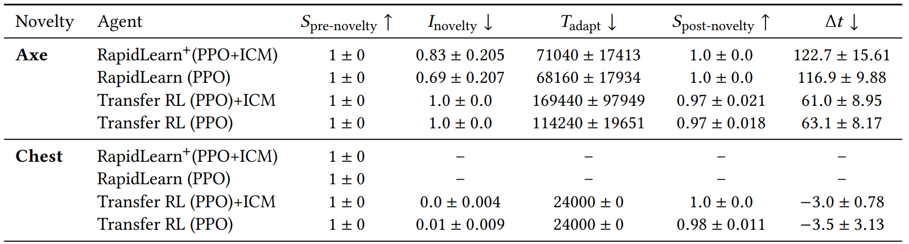

# Combining Planning & RL Agents

The agent training architecture is made up of the single agent wrapper, the neurosymbolic wrapper, and the reward-shaping wrapper, all of which can be found in the [envs](https://github.com/tufts-ai-robotics-group/NovelGym/tree/main/envs) folder. The wrappers responsible for combining the symbolic planning and reinforcement learning agents are the neurosymbolic wrapper and the reward-shaping wrapper.

In this part of the tutorial, we discuss the two existing case studies, [Changing Reward Based on Planner](#changing-reward-based-on-planner) and [Switching Between Planner & External Agent](#switching-between-planner--external-agent).

## Changing Reward Based on Planner

For reward shaping, the wrapper modifies the reward function based on the domain knowledge in PDDL and the plan given by the planner.

## Switching Between Planner & External Agent

For RapidLearn, the fast_forward function will automatically execute the time steps for RL until no plan could be found or an action failed.

## Benchmark Results

