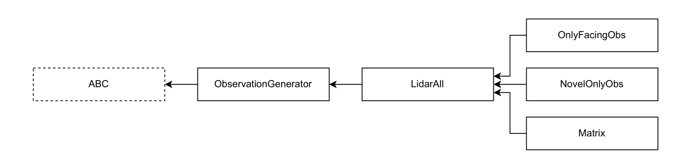

# Defining Spaces

## Observation Space

The implementations of the observation spaces are in the [obs_convertion](https://github.com/tufts-ai-robotics-group/NovelGym/tree/main/obs_convertion) folder. The base class is [ObservationGenerator](https://github.com/tufts-ai-robotics-group/NovelGym/blob/main/obs_convertion/base.py), which outlines methods to be implemented in an observation space. See the diagram below for the full class interdependence.

### Currently Implemented

All of the currently implemented observation spaces are gymnasium Box spaces. The [LidarAll](https://github.com/tufts-ai-robotics-group/NovelGym/blob/main/obs_convertion/lidar_all.py) class has a single Box space made from a one-dimensional vector with the item selected by the agent, the agent's inventory, and the euclidean distances to the objects that strike the LiDAR beam sent by the agent in 45 degree increments. The children [OnlyFacingObs](https://github.com/tufts-ai-robotics-group/NovelGym/blob/main/obs_convertion/only_facing.py) and [NovelOnlyObs](https://github.com/tufts-ai-robotics-group/NovelGym/blob/main/obs_convertion/only_hinted.py) limit the number of LiDAR beams sent and the types of objects detected respectively. The child [Matrix](https://github.com/tufts-ai-robotics-group/NovelGym/blob/main/obs_convertion/matrix.py) holds a dictionary with three Box spaces, one for the agent's selected item, one for the agent's inventory, and one for the agent's local view, stored as a two-dimensional square image.

### Adding New

The easiest way of adding a new observation space is by declaring a child of [LidarAll](https://github.com/tufts-ai-robotics-group/NovelGym/blob/main/obs_convertion/lidar_all.py) and overriding those parts of the parent class that differ in the theoretical new observation space. The more complex part is integrating the new space in training. If the structure of the new space differs from that under [LidarAll](https://github.com/tufts-ai-robotics-group/NovelGym/blob/main/obs_convertion/lidar_all.py), a compatible net must be added to the [net](https://github.com/tufts-ai-robotics-group/NovelGym/tree/main/net) folder, a new policy implemented in the [policy_utils.py](https://github.com/tufts-ai-robotics-group/NovelGym/blob/main/policy_utils.py) file, and a case added to the [train.py](https://github.com/tufts-ai-robotics-group/NovelGym/blob/main/train.py) so that the right policy-maker is called instead of `create_policy` when the new observation space is being used.

Any newly implemented observation space should be placed in the [obs_convertion](https://github.com/tufts-ai-robotics-group/NovelGym/tree/main/obs_convertion) folder, listed in the [obs_convertion/\_\_init\_\_.py](https://github.com/tufts-ai-robotics-group/NovelGym/blob/main/obs_convertion/__init__.py) file consistent with the spaces already there, and included under `OBS_TYPES` in [config.py](https://github.com/tufts-ai-robotics-group/NovelGym/blob/36f78f5e25475a43a8a83627939a5744d0a42c0c/config.py) so that the space can be chosen when training is being run from the command line.

## Action Space

The agent's action space is automatically generated from the config file and no advanced modifications are required when integrating new actions. However, one may wish to modify or override the `action_space` method of the [SingleAgentWrapper](https://github.com/tufts-ai-robotics-group/NovelGym/blob/main/envs/single_agent_standard.py) class, explored in the [Combining Planning & RL Agents](combining) part of the tutorial.

## Reward Function

The reward is generated from the above-described observation module by the [SingleAgentWrapper](https://github.com/tufts-ai-robotics-group/NovelGym/blob/36f78f5e25475a43a8a83627939a5744d0a42c0c/envs/single_agent_standard.py) and passed to the integrated external RL agent. Additional reward generation occurs in the reward-shaping and neurosymbolics wrappers, found in the [envs](https://github.com/tufts-ai-robotics-group/NovelGym/tree/main/envs) folder and described in detail in the [Combining Planning & RL Agents](combining) part of the tutorial.
