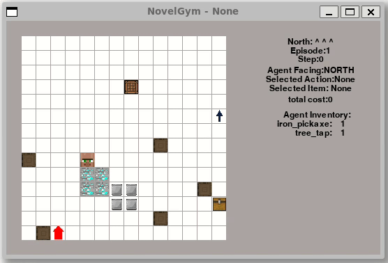

# Keyboard Demo

To get a feel for the game the agent will learn, run the following command from the root of the [NovelGym](https://github.com/tufts-ai-robotics-group/NovelGym) repository.

```
python manual_novelty_test1.py --novelty none --env sa
```

A window like the one below will pop up, rendering the environment and the agent navigating it.



The red arrow is the agent. You can control it by typing the integer corresponding to the desired action next to the prompt `action: `. For instance, `action: 2`, which corresponds to `approach_oak_log`, will make the agent move towards the closest oak log.

**Tips**:

+ The `--novelty none` flag means that we are testing the environment without any novelties. Try changing this flag to any of the options listed when running the script with `--help`.

+ The `--env sa` chooses the single agent wrapper. This will be the default environment for the [Customizing Environments](../category/customizing-environments) part of the tutorial. For more on agent wrappers, see the [Combining Planning & RL Agents](../agent/combining) part.
