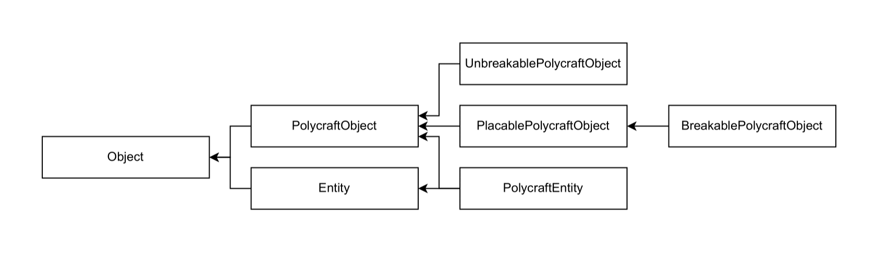

# Examples of Objects & Actions

The implementations of the objects and actions for the base environment are in the [NovelGridWorldsV2](https://github.com/tufts-ai-robotics-group/NovelGridWorldsV2) repository, which you will have installed together with its wrapper repository [NovelGym](https://github.com/tufts-ai-robotics-group/NovelGym). In this part of the tutorial, we explore how the individual object and action classes relate to each other and how a specific object or action is implemented and integrated in the infrastructure.

## Objects

The base class for objects and entities is the [Object](https://github.com/tufts-ai-robotics-group/NovelGridWorldsV2/blob/main/gym_novel_gridworlds2/object/object.py) class, the children of which are [PolycraftObject](https://github.com/tufts-ai-robotics-group/NovelGridWorldsV2/blob/main/gym_novel_gridworlds2/contrib/polycraft/objects/polycraft_obj.py) and [Entity](https://github.com/tufts-ai-robotics-group/NovelGridWorldsV2/blob/main/gym_novel_gridworlds2/object/entity.py). See the diagram below for the full class interdependence.

The easiest way of implementing an entity that moves and has their own inventory where they can store objects is by declaring a child class of [PolycraftEntity](https://github.com/tufts-ai-robotics-group/NovelGridWorldsV2/blob/main/gym_novel_gridworlds2/contrib/polycraft/objects/polycraft_entity.py). To implement an object that may or may not be breakable, collectable, or placeable, declaring a child class of [PolycraftObject](https://github.com/tufts-ai-robotics-group/NovelGridWorldsV2/blob/main/gym_novel_gridworlds2/contrib/polycraft/objects/polycraft_obj.py) is the way to go. We demonstrate the construction of one entity and two objects, one of which has an inventory itself. This is to showcase the flexibility of the infrastructure.

### `OakLog`

### `Chest`

### `EntityTrade`

## Actions

### Easy:

### Medium:

### Hard:
