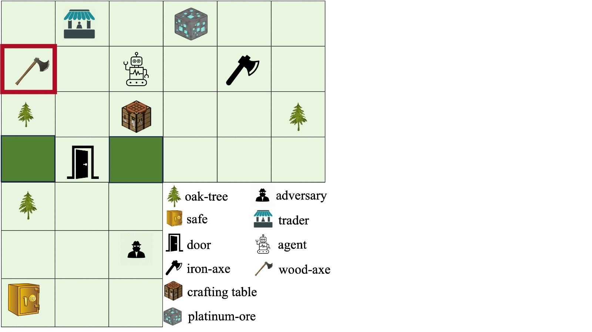

# Running Example

This section includes a description of the rules and goal of the game in the environment implemented in [NovelGym](https://github.com/tufts-ai-robotics-group/NovelGym/tree/main). The image below is for illustrative purposes only and does not represent the actual rendering.

We consider a simple gridworld environment. This environment can be split into multiple rooms connected by doors. In the image above, the agent starts facing a crafting table (used to craft tools and items).

## Goal Description

The goal of the agent is to craft a pogo stick. To do this, it needs to collect various resources and combine them using crafting recipes.

## Rules of Game

While working towards the goal, the agent needs to:

+ move – use actions like "move forward" or "turn left" and look for resources,

+ collect resources – break objects such as logs to be able to collect them,

+ craft – combine resources according to recipes and use crafting table if needed,

+ trade – interact with traders to acquire additional resources,

+ compete – if there is another agent who want to craft the pogo stick first.

**Note**: This is a simplified example. The actual complexity of the task and environment will vary depending on the specific single-/multi-agent scenario you are working with.
